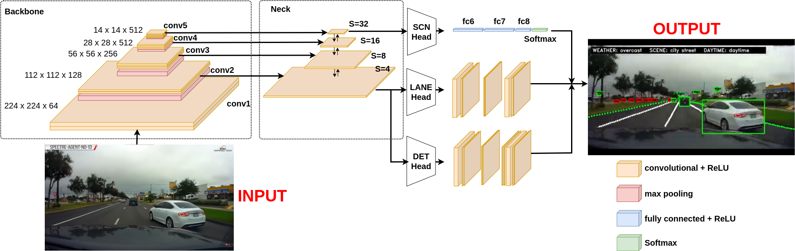

# Multitasking-For-Autonomous

## To do task 
- [x] Model
- [x] Setup Board
- [ ] API
- [ ] Sensor
- [ ] Hardware Controller 
---

## <div align="center">Model</div>
<p align="center">
 
</p>

---

## <div align="center">Requirements</div>

Clone repo and install [requirements.txt](https://github.com/dotrannhattuong/Multitasking-For-Autonomous/blob/main/requirements.txt) in a
[**Python>=3.8**](https://www.python.org/) environment, including
[**PyTorch>=1.8.1**](https://pytorch.org/get-started/previous-versions/).

```
# CUDA 10.2
conda install pytorch==1.8.1 torchvision==0.9.1 torchaudio==0.8.1 cudatoolkit=10.2 -c pytorch

pip install cupy-cuda102==10.5.0


# CUDA 11.3
conda install pytorch==1.8.1 torchvision==0.9.1 torchaudio==0.8.1 cudatoolkit=11.3 -c pytorch -c conda-forge

pip install cupy-cuda113==10.5.0
```

```
pip install -r requirements.txt
```

Note: To perform inference using TensorRT the framework must be installed following the NVidia [documentation](https://docs.nvidia.com/deeplearning/tensorrt/install-guide/index.html).
We officially supportonly `TensorRT version 8.4.0`.

```
python3 -m pip install --upgrade tensorrt
```

## <div align="center">Inference</div>

<details>
<summary>Inference using PyTorch</summary>

- [Video demo](https://drive.google.com/file/d/1zS3L01VHwtPS9WrmOUD5G2V_A4rK7fB-/view?usp=sharing)

```
python inference/run.py -c <path_to_config>.json -w <path_to_checkpoint>.pth -v <path_to_video>.mp4
```

- In addition you can add the option `-o true` to perform conversion to `.onnx`

</details>

<details>
<summary>Interence using TensorRT</summary>
 
The sample inference code is similar to the PyTorch version, but it requires as input the `.onnx` model and the video file.
When a model is loaded for the first time it is converted to tensorrt, this process usually takes a very long time.

```
python inference/run_tensorrt.py -m weights/mobilenetv2_bifpn_sim.onnx -v videos/dashcam_demo.mp4
```

</details>

<details>
<summary>Running on NVidia Jetson</summary>

We provide a script to automatically install all the requirements on an Nvidia board, it is only tested on Jetson AGX Xavier
and Jetson Nano on a fresh install of `JetPack 4.6.1`

```
cd docs
chmod +x deps.sh
./deps.sh
```

The installation process require a very long time, at the end reboot is required. When done inference can be performed using TensorRT as described above.

</details>


### Model Zoo
| **Model**            |       **configuration**       |         **weights**          |             **onnx**              |             **tensorrt**              |
|:--------------------:|:-----------------------------:|:----------------------------:|:---------------------------------:|:---------------------------------:|
| **resnet34_simple**      |   [resnet34_simple.json](https://drive.google.com/file/d/1uZqNuCwI3OHAUNG450XZQD2pQT7YIpDr/view?usp=sharing)    |   [resnet34_simple.pth](https://drive.google.com/file/d/1v5pa3LdXgjjsAiMxMgitBiy6brObskht/view?usp=sharing) (**116.2MB**)    |   [resnet34_simple_sim.onnx](https://drive.google.com/file/d/1MOBMinfU0PrT8hPjjc7gXG4HOHYGCP7K/view?usp=sharing) (**116.0MB**)    |    [resnet34_simple_sim.trt]()   |
| **resnet34_bifpn**       |    [resnet34_bifpn.json](https://drive.google.com/file/d/1Ixuj72Rj2zFasyB-mu7rQiNuA6Yv2ZGg/view?usp=sharing)    |    [resnet34_bifpn.pth](https://drive.google.com/file/d/16jXHf1kEhR3QaXkJxijDxKbGwhNkbUEe/view?usp=sharing) (**89.2MB**)    |    [resnet34_bifpn_sim.onnx](https://drive.google.com/file/d/18xoh22M0wR5O5yu4mDyKcytQaqxhN4hP/view?usp=sharing) (**88.9MB**)    |    [resnet34_bifpn_sim.trt]()   |
| **resnet50_bifpn**       |    [resnet50_bifpn.json](https://drive.google.com/file/d/1eXv7JJGFqHXy3Am0G-xu2ulKm4iRmEz5/view?usp=sharing)    |    [resnet50_bifpn.pth](https://drive.google.com/file/d/1Sm33JXcWo9a0uiOoqv02yKss1SkEUOWT/view?usp=sharing) (**99.0MB**)    |    [resnet50_bifpn_sim.onnx](https://drive.google.com/file/d/1ER6weOsLPgX-GdS53ikr0oI-al2g7Yv8/view?usp=sharing) (**98.5MB**)    |    [resnet50_bifpn_sim.trt]()   |
| **resnet101_bifpn**      |   [resnet101_bifpn.json](https://drive.google.com/file/d/1-5aEQMul1j-Wr8jrOB2CH8yhYysuuXe5/view?usp=sharing)    |   [resnet101_bifpn.pth](https://drive.google.com/file/d/1Fc2yXc04CB1vsZnZSy1WT6rxjOJPMLjc/view?usp=sharing) (**175.3MB**)    |    [resnet101_bifpn_sim.onnx](https://drive.google.com/file/d/1hCdz6o0PvNf5IF0-27tVPrh9OJKLD0W7/view?usp=sharing) (**174.4MB**)    |    [resnet101_bifpn_sim.trt](https://drive.google.com/file/d/120w5aahzMuq0AjR7LCyj8qmibi5ub1Xk/view?usp=share_link)(**90.9MB**)   |
| **efficientnetb2_bifpn** | [efficientnetb2_bifpn.json](https://drive.google.com/file/d/1_F6JBX5i6wxV_MmcyaWnt95dOg3WlYUo/view?usp=sharing) | [efficientnetb2_bifpn.pth](https://drive.google.com/file/d/16wJCSj7bSAt_iPdPytWtH6TOtL8_LQ0x/view?usp=sharing)(**35.3MB**)    |    [efficientnetb2_bifpn_sim.onnx](https://drive.google.com/file/d/1AkLHe8-KtsZ6sD-qLYl4DLlhYqaT_gdA/view?usp=sharing)(**34.7MB**)    |    [efficientnetb2_bifpn_sim.trt](https://drive.google.com/file/d/1yU7o6TeBIHTAHTG6QNZ5UCm24gaNox2b/view?usp=share_link)(**23.1MB**)    |
| **mobilenetv2_bifpn**    |  [mobilenetv2_bifpn.json](https://drive.google.com/file/d/1ikR9ia9k9zVMznfuRbGryecfrVfB_GXU/view?usp=sharing)   |  [mobilenetv2_bifpn.pth](https://drive.google.com/file/d/1WZ3vPPSAF23yGpMIA4DINaBE-6-v2ZH9/view?usp=sharing)(**11.2MB**)   |  [mobilenetv2_bifpn_sim.onnx](https://drive.google.com/file/d/1YUYp-QqSzvJDJj5bbdrA4crZBn_xMpvf/view?usp=sharing) (**10.9MB**)    |    [mobilenetv2_bifpn_sim.trt](https://drive.google.com/file/d/1LXhJ8M5ddI8d-bwu_xiA-hRIL21zV8RP/view?usp=share_link)(**8.4MB**)   |


## <div align="center">Training</div>

### Dataset
Only BDD100K is supported, the dataset is available for free from the autors (https://bdd-data.berkeley.edu/).
After downloading the dataset a pre-processing step is required to encode the lane makins annotations in the format required by Cerberus,
we provide the script `data/bdd100k_lane_keypoints.py` to take care of this step.

```
cd data
python bdd100k_lane_keypoints.py -i <BDD100k_root>/bdd100k_images/images/100k -l <BDD100k_root>/bdd100k_lanes/labels/lane
```

The files `train_25_new.pt` and `val_25_new.pt` will be saved in the `/data` directory. If you have any problem in this step we provide the preprocessed labels [here](https://drive.google.com/file/d/1Cz7GByXW57IiVzHNY5SyDW3LuRt_GuMp/view?usp=sharing)

### Start training
Adjust the configuration `.json` file in `./conf/experiments` accordingly to the directories where you extracted the dataset and the processet lane labels.
```
python main.py --exp_name=<name_of_conf_file>
```

Please notice that the `.json` extension is NOT part of the experiment name: 
```i.e, conf file is "experiments/resnet34_bifpn.json" --> --exp_name=resnet34_bifpn```


## <div align="center">References</div>
https://github.com/phongkhanh/multitask_car